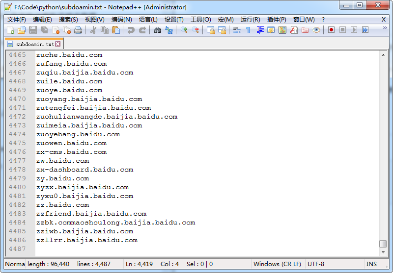

## 一、脚本说明

有时候难免需要快速获取子域名，这时可以百度云观测接口获取子域名数据。

```
http://ce.baidu.com/index/getRelatedSites?site_address=xxx.com
```

但是通过该接口，我们得到的结果是一个json数据。 **这时可以使用该脚本快速获取子域名json数据，然后解析json，提取所有子域名保存到一个txt文本中。**

## 二、使用步骤

以收集`baid.com`这个域名的子域名为例，输入以下命令，即可3秒内获取到4486个百度的子域名。

```
F:\Code\python
$ python getSubdomainFromBaidu.py baidu.com
[+] Number of subdomains: 4486
[+] Successfully exported to subdoamin.txt
```

最终效果如下：

