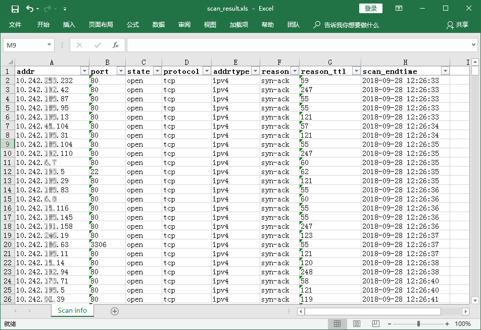

## 使用步骤

##### 1.使用masscan进行扫描，扫描结果以xml保存

```
masscan.exe -p21,22,23,80,7001,5900 10.0.0.0/8 --rate=100000 -oX scan_result.xml
```

##### 2.使用上面写的脚本转换出xls格式的报告

```
masscan-report-converter.py -i scan_result.xml -o scan_result.xls
```

最终效果如下：


